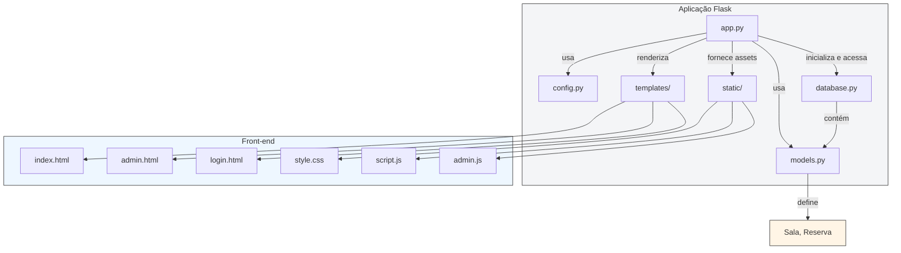

# Diagrama de Pacotes - ReservaSala

## Descrição
Este diagrama de pacotes mostra a organização do projeto ReservaSala e as dependências entre seus módulos.

## Pacotes principais

- `app.py`
  - Ponto de entrada da aplicação
  - Registra rotas Flask
  - Renderiza templates HTML
  - Expõe endpoints REST

- `config.py`
  - Configurações da aplicação
  - `SQLALCHEMY_DATABASE_URI`, `SECRET_KEY`, `ADMIN_PASSWORD`

- `database.py`
  - Configura a conexão com o banco usando `Flask-SQLAlchemy`
  - Integra o objeto `db` ao Flask

- `models.py`
  - Define as entidades do domínio: `Sala` e `Reserva`
  - Mapeia as classes para tabelas do banco de dados

- `templates/`
  - Camada de apresentação HTML
  - `index.html`, `admin.html`, `login.html`

- `static/`
  - JavaScript e CSS que controlam a interação da UI
  - `script.js`, `admin.js`, `style.css`

## Observação
No contexto do projeto Flask, o diagrama de pacotes é uma representação de módulos e camadas, em vez de pacotes Java formais. Este diagrama mostra a separação entre:

- apresentação (templates + estáticos)
- lógica de aplicação (`app.py` + serviços)
- persistência (`database.py`, `models.py`)

Se quiser, posso também gerar uma versão simplificada para incluir diretamente em slides ou relatório.`